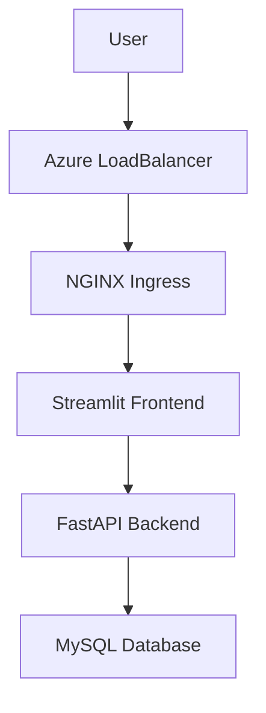

# AKS Backend–Frontend Project
FastAPI API + MySQL + Streamlit Frontend on Azure Kubernetes Service (AKS)

---

## 📘 Technical Documentation (GitHub Pages)

Full AKS & Kubernetes technical documentation is available here:

👉 **https://serguei59.github.io/aks-backend-project/**

This documentation covers:
- Kubernetes fundamentals
- AKS-specific behavior
- Networking & Ingress
- CI/CD GitHub Actions
- Troubleshooting
- Architecture diagrams

## 🚀 Overview

This project demonstrates a **complete but intentionally simple AKS deployment**, combining:

- **Streamlit** frontend  
- **FastAPI** backend  
- **MySQL** database  
- **Azure Kubernetes Service (AKS)**  
- **GitHub Actions CI/CD**

✅ The project is **fully functional end-to-end**  
✅ The **API is NOT publicly exposed** (security-compliant)  
✅ The architecture is aligned with the **course brief**  
✅ Advanced features (PVC, Terraform, custom DB image) are clearly identified as **next steps**

This version focuses on **clarity, robustness, and evaluability**, not over-engineering.

---

## 🎯 Project Objectives

- Deploy a multi-service application on AKS
- Implement a working CI/CD pipeline with GitHub Actions
- Respect security constraints (private API)
- Demonstrate Kubernetes fundamentals clearly
- Deliver a stable, reproducible setup for evaluation

---

## 🧩 Technical Components

| Component | Technology |
|--------|-----------|
| Frontend | Streamlit |
| Backend | FastAPI |
| Database | MySQL (official image) |
| Container Registry | GitHub Container Registry (GHCR) |
| Orchestration | Kubernetes (AKS) |
| CI/CD | GitHub Actions |
| Ingress | ingress-nginx |

---

## ✅ Key Design Choices (Explained)

### ✅ No PersistentVolumeClaim (PVC)

**Why?**

- The course brief does not require production-grade persistence
- PVC introduces extra cloud dependencies and cost
- The MySQL container is re-initialized deterministically via SQL script

👉 **Trade-off accepted**: data is ephemeral, but deployment is simple and robust.

---

### ✅ API Not Exposed Publicly

- API runs as a **ClusterIP service**
- Only accessible **inside the cluster**
- Streamlit frontend acts as the only external entry point

✅ This complies with **security best practices** and the course instructions.

---

### ✅ Streamlit → API Communication

- Streamlit calls the API via **internal Kubernetes DNS**:

```
http://api.sbuasa.svc.cluster.local:5000
```

- No public API endpoint required

---

## 🏗️ Architecture Overview

```text
AKS Cluster
├─ Namespace: ingress-nginx
│   └─ nginx Ingress Controller (LoadBalancer)
│
└─ Namespace: sbuasa
    ├─ Streamlit Frontend  (ClusterIP)
    ├─ FastAPI Backend     (ClusterIP)
    ├─ MySQL Database      (Deployment)
    ├─ ConfigMaps
    └─ Secrets
```

---

## 📐 Mermaid Architecture Diagram



---

## 📂 Project Structure

```text
.
├─ .github/workflows/
│   └─ aks-deploy.yml
│
├─ k8s/
│   ├─ backend/
│   │   ├─ api-deployment.yaml
│   │   ├─ api-service.yaml
│   │   ├─ db-deployment.yaml
│   │   ├─ db-service.yaml
│   │   ├─ configmap.yaml
│   │   └─ secret.yaml
│   │
│   ├─ front/
│   │   ├─ front-deployment.yaml
│   │   ├─ front-service.yaml
│   │   └─ front-configmap.yaml
│   │
│   └─ network/
│       └─ ingress.yaml
│
├─ scripts/
│   └─ aks_bootstrap.sh
│
├─ mkdocs_aks_library/
│   ├─ mkdocs.yml
│   └─ docs/
│
└─ README.md
```

---

## 🔁 CI/CD Deployment Flow

1. Trigger via **push** or **manual dispatch**
2. Build Docker images (frontend + backend)
3. Push images to **GHCR**
4. Login to Azure using Service Principal
5. Create or update AKS cluster
6. Install ingress-nginx
7. Apply Kubernetes manifests
8. Patch Ingress with public IP (`nip.io`)
9. Output application URL

---

## ▶️ How to Deploy (Evaluator Guide)

### 1️⃣ Prerequisites

- Azure subscription
- Contributor role
- GitHub repository (forked)
- GitHub Actions enabled

---

### 2️⃣ Create Azure Service Principal

```bash
az login
az account set --subscription <SUBSCRIPTION_ID>

az ad sp create-for-rbac   --name github-aks-deployer   --role contributor   --scopes /subscriptions/<SUBSCRIPTION_ID>   --sdk-auth
```

Save the JSON output.

---

### 3️⃣ Add GitHub Secret

GitHub → **Settings > Secrets > Actions**

Create:

```
AZURE_CREDENTIALS
```

Paste the Service Principal JSON.

---

### 4️⃣ Trigger Deployment

Either:

- Push to `main`
- Or GitHub Actions → **Run workflow**

✅ No manual kubectl commands required.

---

## 🔧 AKS Troubleshooting (Short)

### ❌ No External IP

```bash
kubectl get svc -n ingress-nginx
```

Check:
- Azure Public IP quota
- `publishService.enabled=true`

---

### ❌ Front loads, API fails

```bash
kubectl exec -it <front-pod> -n sbuasa -- curl api:5000/health
```

Likely causes:
- API service name mismatch
- Wrong internal DNS
- Backend pod not ready

---

### ❌ Database access error

- Check database name consistency
- Ensure API config matches MySQL init script
- Restart API deployment

---

## 📚 MkDocs AKS Library

This repository includes a **full AKS documentation library** (concepts, networking, CI/CD, troubleshooting):

```bash
cd mkdocs_aks_library
pip install mkdocs
mkdocs serve
```

➡️ http://127.0.0.1:8000

---

## 🚧 Next Steps (Planned Evolution)

✅ Replace `aks_bootstrap.sh` with **Terraform**  
✅ Introduce **PVC + Azure Disk**  
✅ Build **custom MySQL image**  
✅ Add database migrations  
✅ Environment separation (dev/prod)  

These steps are **intentionally out of scope** for the current validated version.

---

## ✅ Final Status

✔ Project complete and functional  
✔ Architecture explained  
✔ Design choices justified  
✔ Ready for evaluation  

---

**Author**  Serge BUASA
AKS learning project – CI/CD & Kubernetes fundamentals
