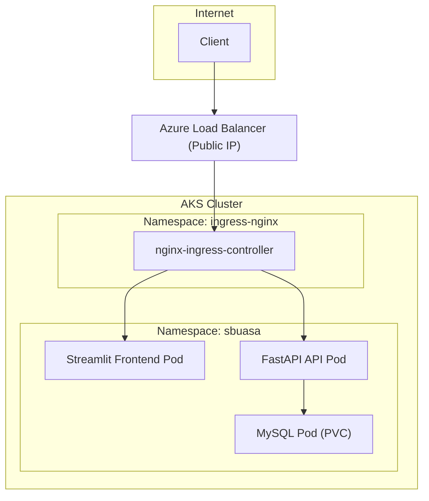

# AKS Backend-Front Project  
API (FastAPI) + MySQL + Streamlit Frontend on Azure Kubernetes Service (AKS)

---

## 🚀 Overview

This project deploys a **Streamlit frontend**, a **FastAPI backend**, and a **MySQL database** on **Azure Kubernetes Service (AKS)**.  
It includes:

- Automated provisioning of AKS and ingress via **GitHub Actions**
- Automatic **build & push** of Docker images to GHCR
- Automatic **Ingress patching** with the public IP
- A complete **mkdocs technical library** for AKS concepts and troubleshooting

---

# 1. Prerequisites

You need:

- Azure account + subscription  
- Contributor role on the subscription  
- GitHub repository (fork or clone)  
- Docker installed (if testing locally)

---

# 2. Create Azure Service Principal

This Service Principal will allow your GitHub Actions to deploy AKS.

```bash
az login
az account set --subscription "<YOUR_SUBSCRIPTION_ID>"

az ad sp create-for-rbac \
  --name "github-aks-deployer" \
  --role contributor \
  --scopes /subscriptions/<YOUR_SUBSCRIPTION_ID> \
  --sdk-auth
```

Copy the JSON output and keep it safe.

---

# 3. Add Credentials to GitHub Secrets

Go to:

**Settings → Secrets and Variables → Actions**

Create secret:

```
AZURE_CREDENTIALS
```

Paste the JSON from the Service Principal.

Used in workflow:

```yaml
- uses: azure/login@v1
  with:
    creds: ${{ secrets.AZURE_CREDENTIALS }}
```

---

# 4. Deployment Triggers

You can trigger the deployment in two ways:

### **A. Push-based triggers**
Deployment runs automatically when pushing to:

```
main
feature/k8s_api-mysql
```

### **B. Manual trigger**
GitHub Actions → Workflow → **Run workflow**

```yaml
on:
  push:
    branches: [ "main", "feature/k8s_api-mysql" ]
  workflow_dispatch:
```

This allows any reviewer/user to deploy manually without pushing code.

---

# 5. CI/CD Pipeline Summary

The pipeline:

1. Builds Docker image for the frontend  
2. Pushes image to **GHCR**  
3. Logs into Azure  
4. Creates/updates resource group  
5. Creates/updates AKS cluster  
6. Installs **ingress-nginx** (via Helm)  
7. Applies all Kubernetes manifests  
8. Waits for **external IP**  
9. Patches Ingress with `${EXTERNAL_IP}.nip.io`  
10. Outputs final public URL  

---

# 6. Project Architecture (AKS)

```text
AKS Cluster
├─ Namespace ingress-nginx
│   ├─ ingress-nginx-controller (Service=LoadBalancer)
│   └─ nginx controller Pods
│
└─ Namespace sbuasa
    ├─ Streamlit Frontend  (Deployment + Service ClusterIP)
    ├─ FastAPI Backend     (Deployment + Service ClusterIP)
    ├─ MySQL Database      (Stateful Deployment + PVC)
    └─ ConfigMaps + Secrets
```

---

# 7. Mermaid Architecture Diagram



---

# 8. Project Structure

```text
.
├─ k8s/
│   ├─ backend/
│   │   ├─ api-deployment.yaml
│   │   ├─ api-service.yaml
│   │   ├─ db-deployment.yaml
│   │   ├─ db-service.yaml
│   │   ├─ pvc.yaml
│   │   ├─ secret.yaml
│   │   └─ configmap.yaml
│   ├─ front/
│   │   ├─ front-deployment.yaml
│   │   ├─ front-service.yaml
│   │   └─ front-configmap.yaml
│   └─ network/
│       └─ ingress.yaml
│
├─ scripts/
│   └─ aks_bootstrap.sh
│
├─ mkdocs_aks_library/
│   ├─ mkdocs.yml
│   └─ docs/...
│
└─ README.md  (this file)
```

---

# 9. Troubleshooting AKS (Quick Guide)

## ❌ Ingress has no external IP  
Check Service:

```bash
kubectl get svc -n ingress-nginx
```

If IP is `<pending>`:

- Helm flag missing: `controller.publishService.enabled=true`
- Azure quota exhausted (Public IPs)
- Wrong resource group for PIP

---

## ❌ Frontend loads but API unreachable  
Check DNS inside cluster:

```bash
kubectl exec -it <frontend-pod> -- curl api:5000/health
```

If fails:

- Wrong `API_URL` in ConfigMap
- Service name mismatch
- Pod not ready

---

## ❌ MySQL not reachable  
Inspect PVC:

```bash
kubectl get pvc -n sbuasa
kubectl describe pvc mysql-pvc -n sbuasa
```

Check DB logs:

```bash
kubectl logs -n sbuasa deploy/mysql
```

---

## ❌ Ingress 404  
Check routing rules:

```bash
kubectl describe ingress front-ingress -n sbuasa
```

Common causes:

- wrong host  
- wrong path  
- Service port mismatch  

---

# 10. Local MkDocs Documentation

```
cd mkdocs_aks_library
pip install mkdocs
mkdocs serve
```

Open:

👉 http://127.0.0.1:8000/

---

# 11. Credits

Built for AKS learning & production-ready CI/CD workflows.  
Includes a complete AKS knowledge base covering:

- Kubernetes fundamentals  
- AKS specifics  
- Networking  
- Ingress  
- CI/CD  
- Architecture  
- Troubleshooting  

---

